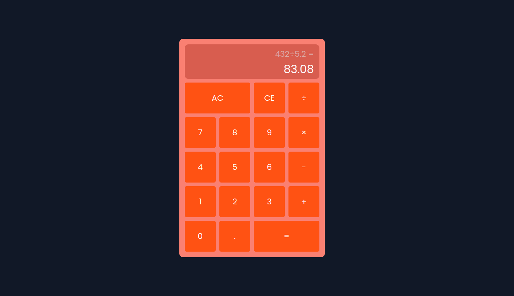

<h1 align='center'>Calculator</h1>

<h3 align='center'>
    <a href='https://panayiotistsg.github.io/calculator/'>Live Demo</a>
</h3>

## Introduction

Welcome to the Calculator project! This project is part of [The Odin Project's Foundations Course](https://www.theodinproject.com/lessons/foundations-calculator). It combines everything I've learned so far about JavaScript, HTML, and CSS to create an on-screen calculator.

## Features

- Basic math operations: addition, subtraction, multiplication, division.
- Operates with two numbers and an operator (e.g., 3 + 5).
- Includes a display to show current input and results.
- All clear button to reset the calculator.
- Handles edge cases like division by zero with appropriate messages.
- Rounds answers with long decimals to avoid overflow.
- Additional features:
  - Decimal input support.
  - Clear entry button to undo the last input.
  - Keyboard support for better usability.

## Usage

1. Open the calculator in your browser.
2. Click the number buttons to input numbers.
3. Click the operator buttons (+, -, *, /) to choose an operation.
4. Click the "=" button to evaluate the expression.
5. Use the "AC" button to reset the calculator.
6. Use the "." button to input decimal numbers (only one decimal point allowed per number).
7. Use the "CE" button to undo the last input.
8. You can also use your keyboard to input numbers and operations.
   - The "Esc" key serves as the clear button.
   - The "Backspace" key serves as the CE (clear entry) button.

## Technologies Used

- HTML
- CSS
- JavaScript